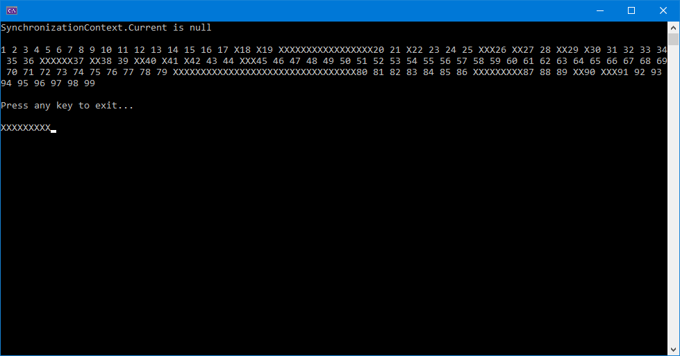

# ConsoleAppProgress
Some async/await Progress<T> console app for testing 

### Screenshot of result:

  
### Notes:
- As you can see in output above, SynchronizationContext.Current is still null in a .NET 6 Console App.
- Progress.Report() (and it´s Post() inside) therefore is spooled onto some ThreadPool WorkerItem.
- The result is: Some random occurrence of that Post()´s happens (the printing of 'X').
- Running the app multiple times always produce other results (random).
- Since it´s not guaranteed when threadpool thread(s) are executed (the spooled Post()´s), they are random.

### Links:
